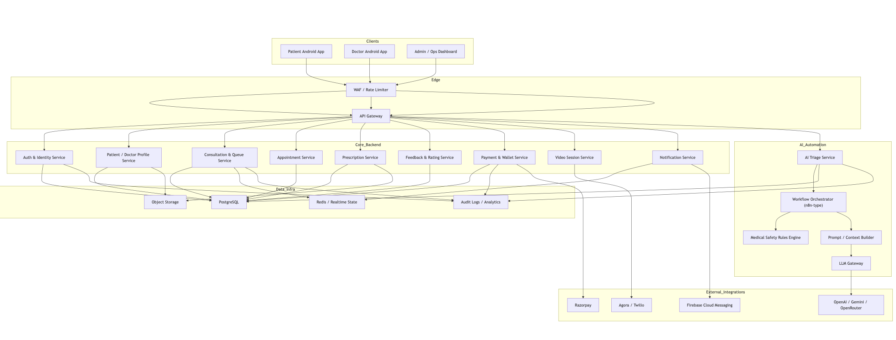

# Lokal MedAssist

Lokal MedAssist is a proposal-stage Android-first healthcare platform designed for tier 2 and tier 3 cities. It combines AI-assisted symptom guidance with doctor-led consultation, prescription management, appointment booking, and patient follow-up.

This repository contains a working MVP with:
- a separate `Patient App`
- a separate `Doctor App`
- a shared `Node.js backend`
- an `AI triage flow` integrated through the backend

## Problem Statement

In smaller cities, healthcare access is often delayed because:
- clinics and hospitals are centralized
- doctors operate in fixed time windows
- many patients travel physically even for basic consultation needs
- non-emergency cases still consume time and create queue pressure
- patients often need local-language guidance before deciding whether to visit a doctor

Lokal MedAssist addresses this by giving patients:
- local-language AI guidance for first-level symptom intake
- a path to escalate to real doctors when needed
- digital bookings, appointments, prescriptions, and feedback

## Product Overview

### Patient App
- patient login and session persistence
- AI medical chat with structured triage output
- patient metadata management
- doctor discovery and consultation booking
- 1:1 video consultation join flow
- appointment history and follow-up booking
- prescription access
- feedback submission

### Doctor App
- doctor login and session persistence
- online/offline availability toggle
- consultation queue view
- consultation start / complete workflow
- patient metadata and consultation context view
- 1:1 video room launch flow
- physical follow-up request flow
- prescription issuance
- wallet and earnings view

### Backend
- patient auth APIs
- doctor auth APIs
- chat history APIs
- doctor listing APIs
- booking APIs
- appointment APIs
- prescription APIs
- feedback APIs
- doctor queue and consultation APIs
- local persistent storage for demo continuity
- OpenRouter-backed AI triage integration

## System Shape

The project is structured as two native Flutter apps backed by a shared backend:

- [apps/patient_app](/Users/aditya/Desktop/Lokal_medass/apps/patient_app)
- [apps/doctor_app](/Users/aditya/Desktop/Lokal_medass/apps/doctor_app)
- [services/patient_backend](/Users/aditya/Desktop/Lokal_medass/services/patient_backend)
- [packages/lokal_health_shared](/Users/aditya/Desktop/Lokal_medass/packages/lokal_health_shared)

## Architecture and Diagrams


Supporting docs:
- [system-architecture.md](/Users/aditya/Desktop/Lokal_medass/docs/system-architecture.md)
- [patient-backend.md](/Users/aditya/Desktop/Lokal_medass/docs/patient-backend.md)
- [deployment.md](/Users/aditya/Desktop/Lokal_medass/docs/deployment.md)

## Repository Layout

```text
Lokal_medass/
├── apps/
│   ├── patient_app/           # Flutter patient application
│   └── doctor_app/            # Flutter doctor application
├── packages/
│   └── lokal_health_shared/   # Shared models and domain helpers
├── services/
│   └── patient_backend/       # Node.js backend + AI integration
└── docs/
    ├── patient-backend.md
    ├── system-architecture.md
    ├── system-design-n8n-style.pdf
    └── system-design-n8n-style.svg
```

## Tech Stack

- Mobile: `Flutter`
- Backend: `Node.js + Express`
- AI Provider: `OpenRouter`
- Local persistence: file-backed JSON store
- Architecture direction: modular backend with workflow orchestration

Recommended production stack:
- Database: `PostgreSQL`
- Cache / realtime: `Redis`
- Video: `Agora` or `Twilio`
- Payments: `Razorpay`
- Notifications: `Firebase Cloud Messaging`

## Demo Credentials

### Patient
- email: `suman.verma@lokal.demo`
- password: `Pass@123`

### Doctor
- email: `meera.sharma@lokal.demo`
- password: `Doc@123`

If credentials do not work because old local data was already created, reset the demo store:

```bash
rm /Users/aditya/Desktop/Lokal_medass/services/patient_backend/data/store.json
```

Then restart the backend to reseed.

## Local Setup

### 1. Start the backend

```bash
cd /Users/aditya/Desktop/Lokal_medass/services/patient_backend
npm install
cp .env.example .env
```

Set values in [services/patient_backend/.env](/Users/aditya/Desktop/Lokal_medass/services/patient_backend/.env):

```bash
PORT=8080
OPENROUTER_API_KEY=your_openrouter_api_key_here
OPENROUTER_MODEL=openrouter/free
JWT_SECRET=replace_this_for_non_demo_usage
```

Then run:

```bash
npm run dev
```

Health check:
- [http://localhost:8080/health](http://localhost:8080/health)

For Android emulator requests, the base URL is:
- `http://10.0.2.2:8080`

### 2. Run the patient app

```bash
cd /Users/aditya/Desktop/Lokal_medass/apps/patient_app
flutter pub get
flutter run -d emulator-5554
```

### 3. Run the doctor app

```bash
cd /Users/aditya/Desktop/Lokal_medass/apps/doctor_app
flutter pub get
flutter run -d emulator-5554
```

### 4. Build public APKs after backend deployment

After you deploy the backend publicly, rebuild both apps with the hosted backend URL:

```bash
cd /Users/aditya/Desktop/Lokal_medass/apps/patient_app
flutter build apk --release --dart-define=PATIENT_API_BASE_URL=https://your-backend-url.onrender.com
```

```bash
cd /Users/aditya/Desktop/Lokal_medass/apps/doctor_app
flutter build apk --release --dart-define=PATIENT_API_BASE_URL=https://your-backend-url.onrender.com
```

If platform folders are missing in an app directory, generate them once:

```bash
flutter create .
```

## Backend API Reference

Detailed backend documentation is available here:
- [patient-backend.md](/Users/aditya/Desktop/Lokal_medass/docs/patient-backend.md)

The backend currently includes:
- patient registration, login, and profile
- doctor login and profile
- patient AI chat and saved conversations
- doctor listing and doctor details
- consultation bookings
- appointments
- prescriptions
- patient feedback
- doctor queue actions
- doctor wallet summary

## MVP Status

This project is ready as a `proposal MVP`.

It is suitable for:
- product demonstration
- architecture discussion
- feasibility validation
- pitch / proposal submission

It is not yet production-ready.

## Current Limitations

The current build still uses MVP-level infrastructure and should not be positioned as a production healthcare release yet.

Missing production hardening includes:
- PostgreSQL or managed cloud database
- real payment gateway integration
- real video consultation SDK integration
- push notifications
- cloud deployment
- admin operations panel
- audit/compliance hardening
- advanced medical safety governance

## Why This Matters

Lokal MedAssist demonstrates a realistic digital healthcare model for underserved city segments:
- AI handles first-level guidance and intake
- doctors handle real consultation and prescription decisions
- patients avoid unnecessary clinic visits
- doctors can handle traffic more efficiently
- Lokal gains a new healthcare service line aligned with its local-language strategy

## Proposal Positioning

The right way to present this repository is:

`A working MVP and technical proposal for Lokal AI’s medical assistance platform, designed for tier 2 and tier 3 cities.`

## License

This repository is currently intended for proposal/demo use.
